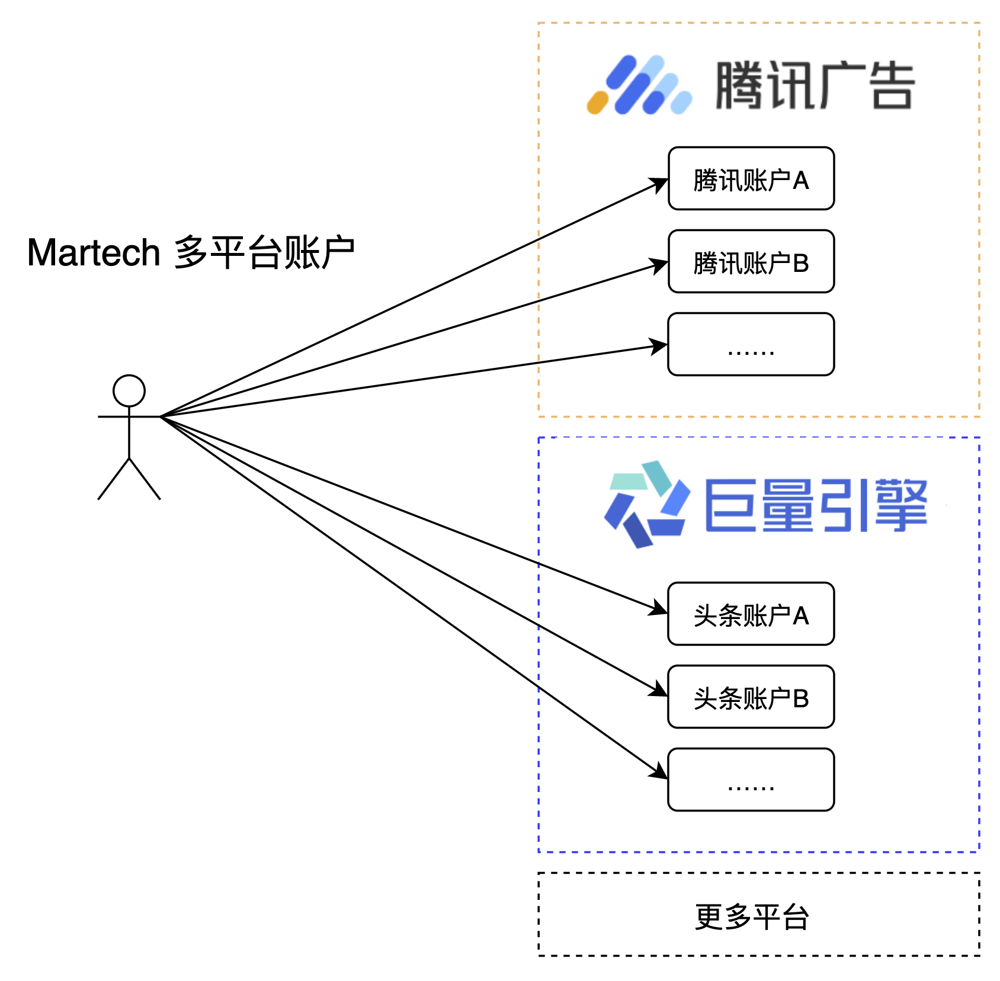
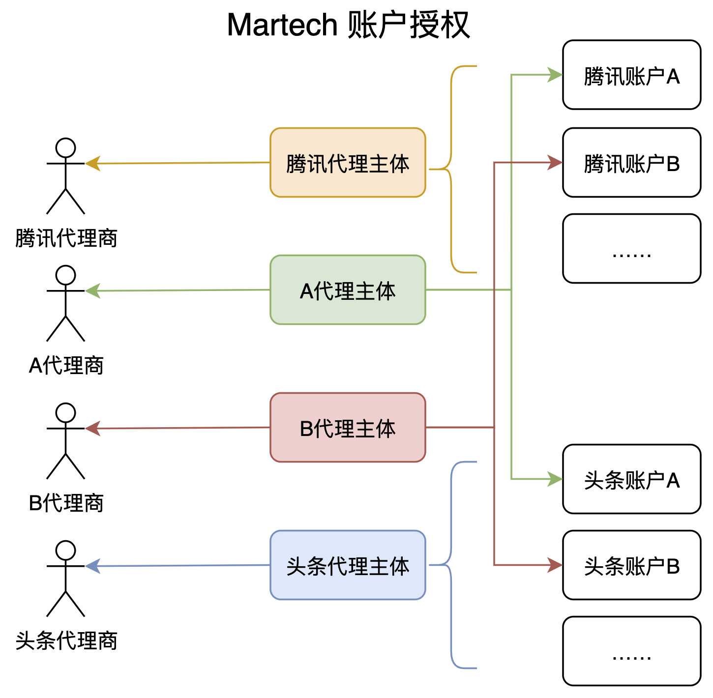
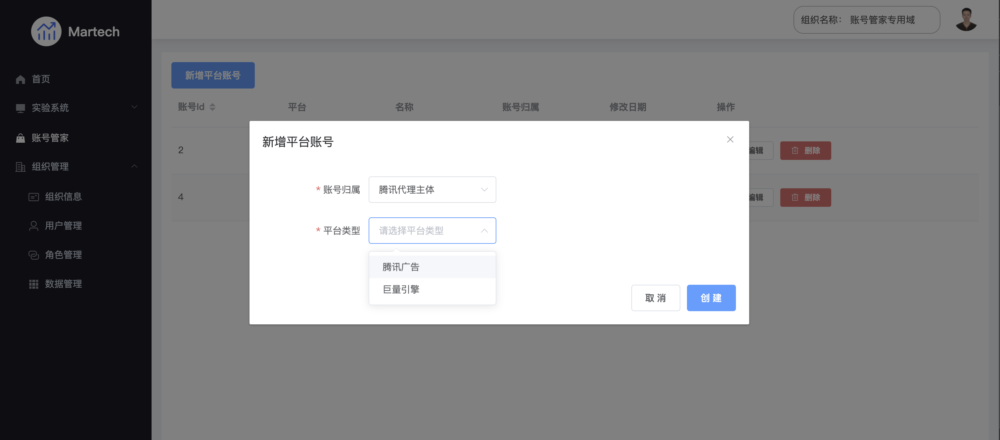
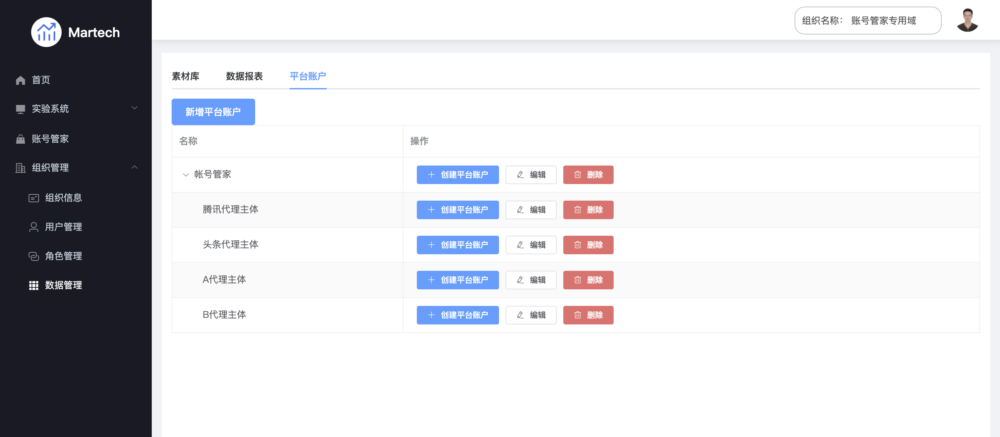
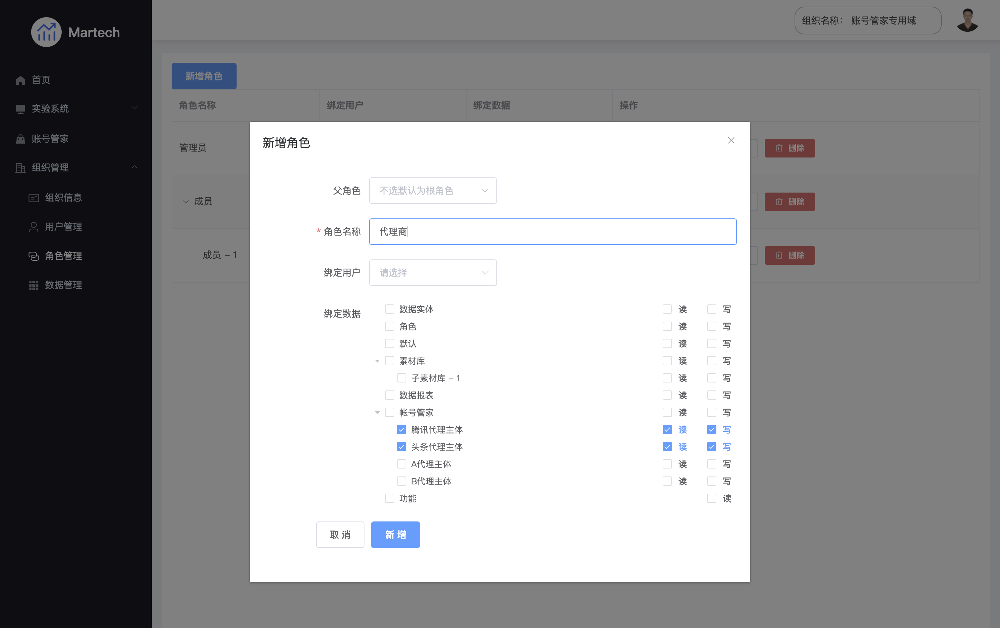

# 跨平台账号管理

## 1. 客户痛点
随着接入的渠道和账户的增多，以往“单平台 - 单账户”的管理模式带来很大的弊端。频繁切换渠道与账号，在广告素材、数据报表等管理上都会带来很大的人力成本。

## 2. 功能介绍
### 2.1 多平台聚合

聚合了核心平台：腾讯广告-AMS、今日头条（巨量引擎），未来还将支持更多平台。

### 2.2 多账号管理

无需切换登录账号，便可完成多个账户的数据、资产管理。

### 2.3 账号归属授权

将账号归属到多个“主体”后，可通过“主体”授权给不同的用户进行使用。

## 3. 界面介绍
 * 3.1 多平台账号授权

 * 3.2 账号归属主体管理

 * 3.3 账号通过主体授权给用户

