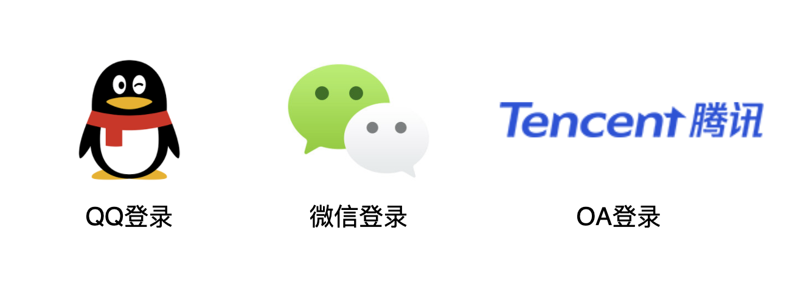
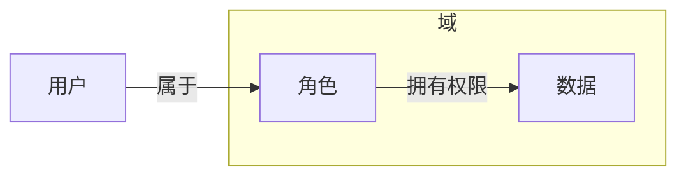
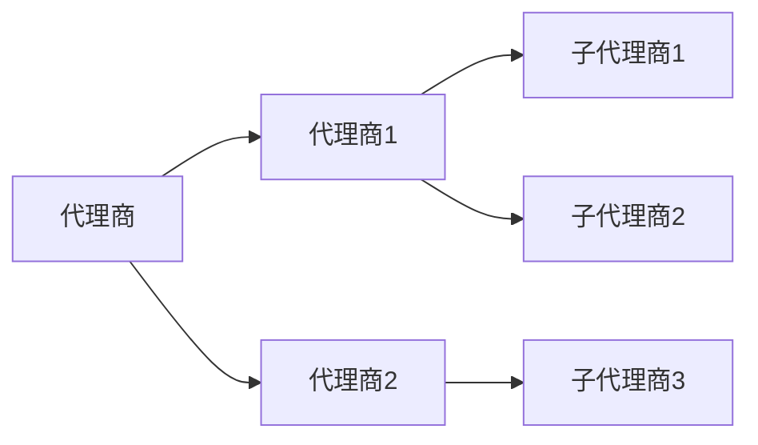
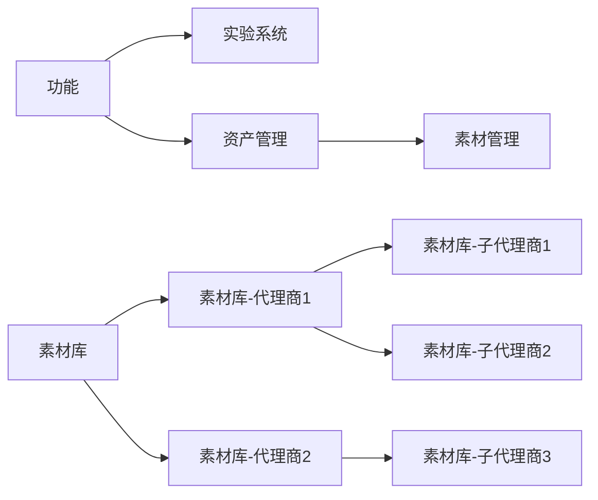

# 权限管理

> 作为一站式平台：需要支持多租户，基于角色控制，数据有权限隔离，用户可扩展，可自定义的权限管理

## 身份认证

支持可扩展的，包括**QQ**，**Wechat**，**TencentOA**等多种登录方式

## 管理权限

基于RBAC模型实现**支持多域/租户**且**支持资源组**的RBAC权限管理模型。

### 用户、角色、数据、域 的模型

基于**用户**、**角色**、**数据**、**域** 设计权限管理模型

- 用户
  - 一个用户可以属于多个角色
  - 一个用户也可以属于不同域
- 角色
  - 一个角色在指定域中可以对多个数据用权限
  - 角色与角色之间可以有父子继承的关系
- 数据
  - 数据可以代表具体的某个功能，也可以代表一类数据
  - 数据有`读`、`写`两种权限
  - 数据与数据之间也可以有父子继承的关系
- 域
  - 租户

### 角色层级设计

在多租户平台中，按角色级别，可分为**超级管理员**、**域管理员**、**域管理员**、**普通用户**四个层级。

- 超级管理员
  - 管理整个平台的功能
  - 管理域的增删改查
- 域管理员
  - 域内的用户、角色、数据、权限的管理
  - 域内的的子管理员的管理
- 域子管理员
  - 域内部分功能和数据的管理
- 普通用户
  - 非管理的普通功能

### 角色与数据的继承关系

角色与角色之间的继承关系。每个角色代表一批用户。

数据与数据之间的继承关系。每个数据代表一类数据，也可以代表一类功能

