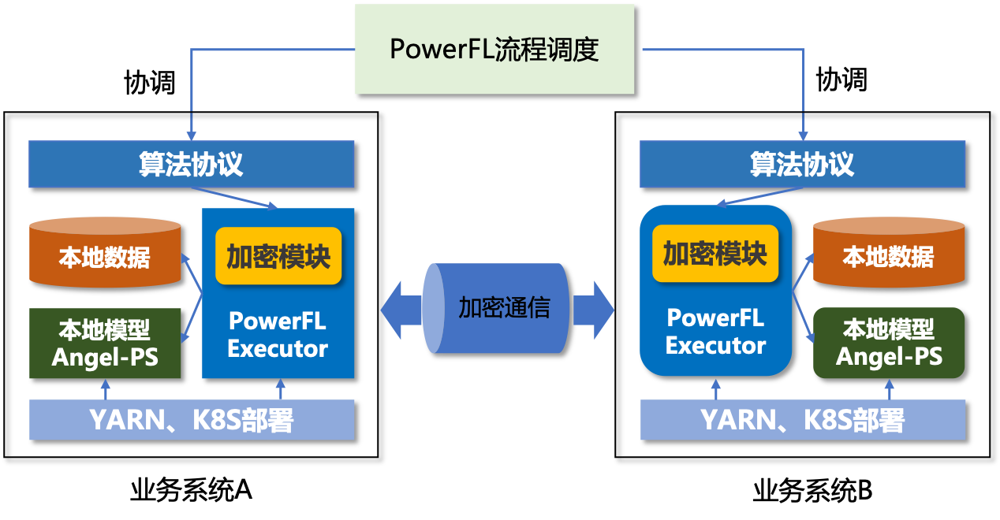

# 联邦学习

## 1. 背景介绍
联邦学习是一种新的机器学习技术，旨在保护合作双方各自数据安全的前提下，双方联合训练、建模、优化模型效果。

联邦学习各方数据不出本地，保护用户隐私，训练过程中仅交换模型相关数据，通信全程加密保障数据安全。

## 2. 系统架构
平台采用腾讯自研的联邦学习平台PowerFL，采用去中心化联邦协议，不依赖第三方，安全性更高。

PowerFL主要包含安全样本对齐（PSI）、联邦模块训练、加密、消息通信及资源管理和调度模块。

整体架构图如下：

    

## 3. 应用场景
联邦学习在金融领域已经有比较多的成功应用案例，广告营销方面的应用有：
 * 广告投放效果提升，降低买量成本，提升后端ROI
 * ADX消耗及效果提升
 * 广告推荐
