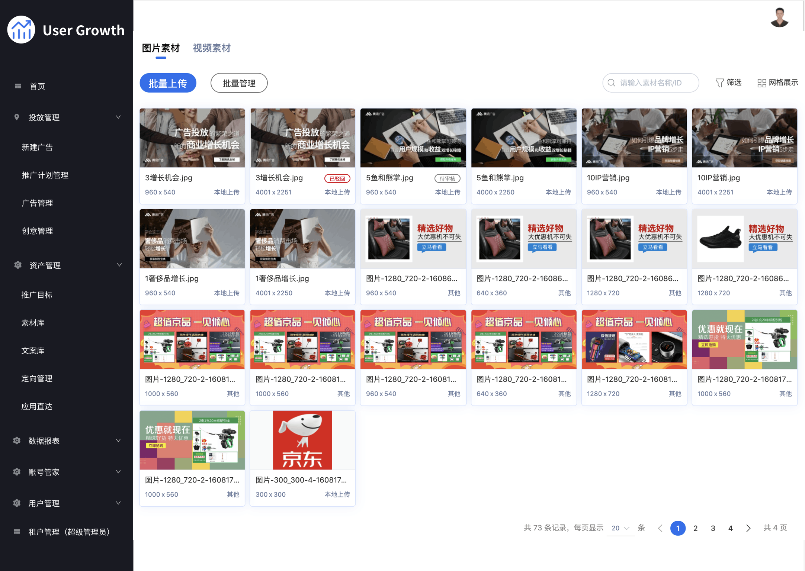
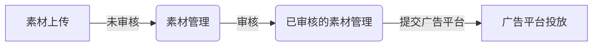

# 资产管理

## 素材库

素材是可以向用户投放的图片、视频、音频以及其他格式的内容。他是一种重要的资产。在将其添加到对应平台的广告素材库之前，我们有必要将这些素材放在我们自己的素材库中，并进行审核和管理等

### 面对的用户

素材管理作为资产管理中的一个模块，主要面向对象：

- 广告主
- 代理商
- 优化师
- 设计师

### 功能

#### 素材管理展示

- 包含历史投放过的素材
- 上传待使用的素材
- 素材的来源等详细信息
- 审核状态

#### 功能点

- 支持用户批量上传素材
- 支持用户批量删除/标记素材
- 支持用户查询素材
- 支持素材审核
