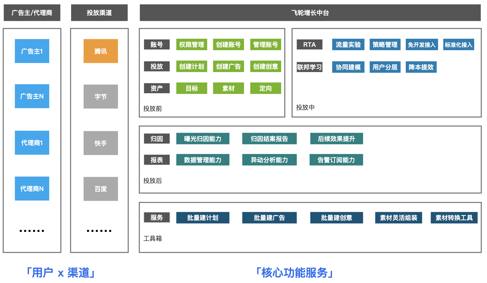
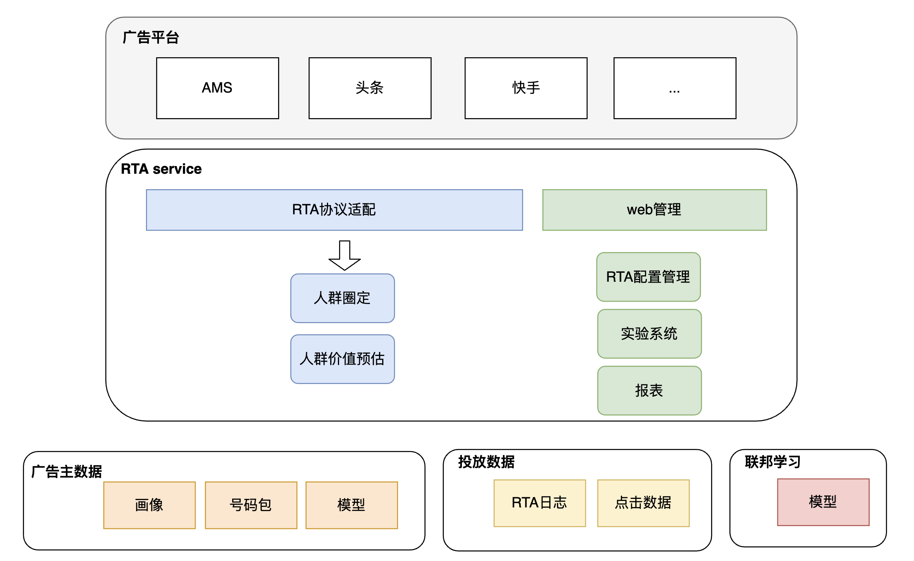
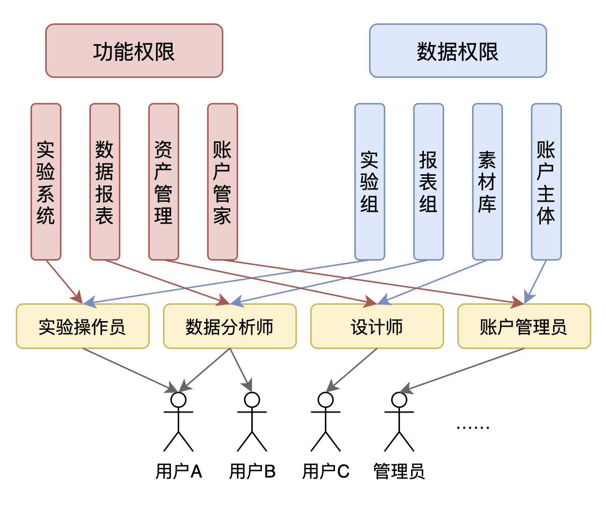
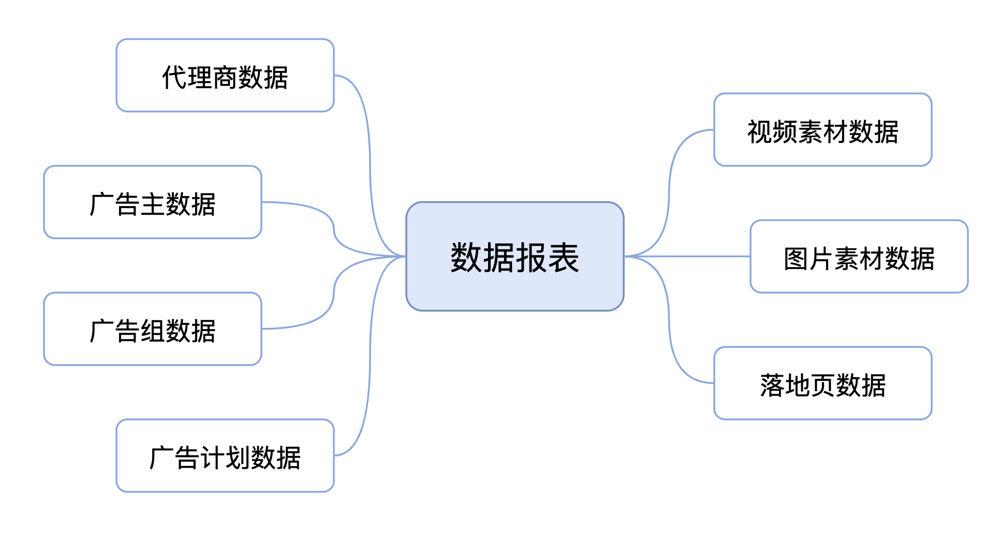
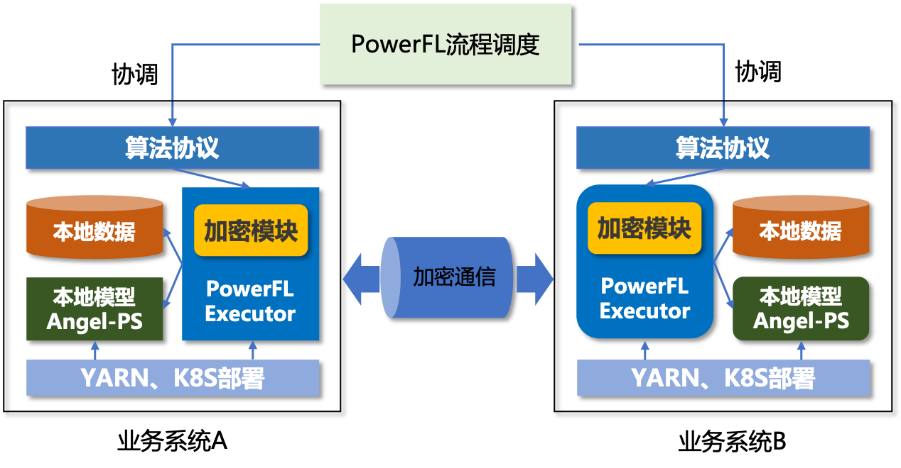
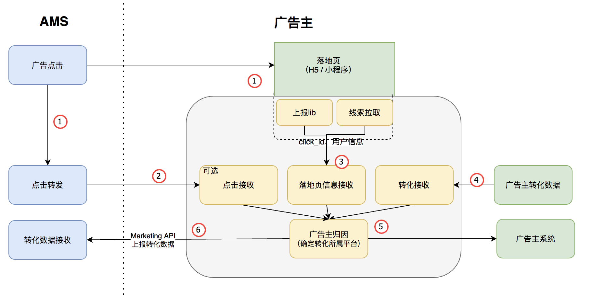

提供智能化广告投放工具、多维度数据分析报表、跨平台多账号综合管理能力，为广告主智能营销赋能。

## 1. 产品架构

### [RTA服务](/RTA/)

基于广告主自身数据，实时参与召回和排序，有效提升广告效果。我们提供灵活强大的RTA能力
 1. 接入简单：广告主只需要提供画像数据接口，就能完成接入
 2. 配置灵活：在接入数据后，不需要开发就能完成策略功能的上线
 3. 实验放量：RTA实验能力，基于AMS数据报表准确分析效果

    

### [权限管理](/Authority/)

作为一站式平台：支持多租户，基于角色控制，数据有权限隔离，用户可扩展，可自定义的权限管理

    

### [跨平台账号](/Advertiser/)

聚合多平台账号体系，支持跨账号数据、资产管理，并支持账号归属与授权。

    

### [资产管理](/Property/)

面向广告主、代理商、设计师提供图片、视频、音频以及其他格式内容的管理与审核。

### [数据报表](/AdReport/)

支持跨平台，多维度，全方位的数据报表查询

### [联邦学习](/FederatedLearning/)

平台采用腾讯自研联盟学习平台PowerFL，提供 **安全样本对齐（PSI）** 、**联邦模块训练**、**加密**等能力，应用在广告营销的三大方向：
 * 广告投放效果提升，降低买量成本，提升后端ROI
 * ADX消耗及效果提升
 * 广告推荐

    

### [归因服务](/Attribution/)

采用业界通用的方式，提供
 * 点击归因
 * 线索归因

 同时基于PSI，在保证平台、广告主数据隐私的情况下实现
 * 曝光归因

    

## 2. 技术架构

