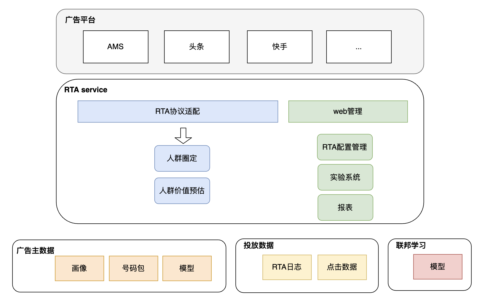

# RTA服务

## 1. RTA介绍


RTA让广告主基于自身画像数据做 个性化召回 + 分人群出价

## 2. RTA常见玩法

| 投放类型 | 策略                                         |
| -------- | -------------------------------------------- |
| 拉活     | 过滤已拉活用户,节省拉活成本                  |
|          | 过滤高概率自启用户                           |
|          | 按用户价值控制拉活出价, 降低拉活时长成本     |
|          | 自建模型 & 联邦学习，使用AMS用户等级出价能力 |
| 拉新     | 过滤已激活用户,节省拉新成本                  |
|          | 联邦学习，利用AMS数据挖掘新用户价值          |
| 通用     | 点击频控：天级别、总次数、点击间隔           |

## 3. 系统能力

### 3.1 人群圈定

RTA很多是基于媒体的用户数据，将对应的用户人群圈定出来。这跟广告系统的定向召回是一样的。这里我们参考广告系统的实现，提供了很灵活的人群圈定方案。

#### 3.1.1**灵活人群选择**

**例子:**

 假设媒体有活跃度、自启率、年龄 这些用户信息，需要实现对 "**一月内未活跃  &&  自启概率 < 0.3 && 年龄处于20-30 岁之间**" 用户人群进行拉活

**步骤：**

1. 媒体定义用户信息schema

```
{
	"version": 1,
	"fields": [
       {
			"name": "age",
			"type": "integer"
		},
		{
			"name": "last_active_time",
			"type": "enum",
			"enum": [
              {
					"value": "1周内"
				},
				{
					"value": "1周以外，1月以内"
				},
				{
					"value": "1月以外"
				}
			]
		},
		{
			"name": "self_active_rate",
			"type": "integer"
		}
	]
}
```


1. 管理端基于schema生成页面
2. 操作人可以根据需求圈定人群，并绑定对应的平台策略（策略ID、广告主ID、推广计划等）


1. RTA Server调用媒体接口，获取用户信息，基于索引结构，匹配到操作人设置的人群，进而获取到对应的平台策略。

**优势：**

1. 支持灵活的用户画像信息，媒体只需要定义schema
2. 新增维度不需要额外的开发，只需要修改schema，同时媒体画像接口支持返回对应的维度
3. 检索算法基于论文做了两次优化，性能好，不用担心延时问题

#### 3.1.2 号码包

对于比较特殊的规则或者数据，离线训练号码包，在线加载，支持BloomFilter过滤。

同时，号码包可以作为人群选择的一个条件。

### 3.2 人群出价 & 联邦学习

联邦学习旨在不泄露AMS侧核心数据基础上利用AMS侧用户数据提高RTA买量效率，主要步骤可以分为如下几个步骤：模型训练样本对齐、模型训练、模型结果运用。

模型训练样本对齐：因为涉及到双方联合训练同一个模型，因此在训练时需要保证双方能够识别到同一条样本，因此需要做样本对齐。 RTA买量这里主要采用设备号信息（imei + idfa + oaid）作为key做样本对齐，采用三种设备号可以显著提高匹配覆盖率。

模型训练：合作双方（AMS侧和买量业务侧）共同训练一个模型，业务侧提供业务侧原始特征（可选）和模型训练label（必须），AMS侧提供AMS侧用户数据特征，双方仅交互交互层的embedding和梯度信息，因此双方的原始数据对方都不感知，采用腾讯自研的powerFL训练框架开始模型训练。

​               

模型结果运用：AMS侧根据联邦学习中AMS侧模型提供AMS全量用户的交互层embedding给到业务侧，用于拉新和拉活需求。如果业务侧不提供特征，AMS侧可以直接算出全量用户score并集成到RTA中

### 3.3 策略实验


包含以下步骤

1. 运营人员线下沟通创建ams的RTA联合实验
2. 在配置了对应的权限（RtaID 和 Token）后，管理端会自动从AMS同步实验信息
3. 基于实验目的创建
   1. 实验参数，RTA Server 配套使用的参数，比如点击过滤可以定义为click_threshold
   2. 实验，包含多个实验参数值，如click_threshold=1。同时通过绑定一个或者多个AMS实验，控制参数生效的流量比例
   3. 实验组，包含多个实验，不同实验之间可以相互对比
4. 创建完实验后，实验配置会同步给RTA Server，参考章节1.2，有两种不同的实现
5. 在AMS请求RTA Server的时候，会带上Exp ID，根据Exp ID和实验配置，能获取到本次生效的实验参数以及参数值，进而影响影响对应的业务逻辑
6. 通过报表API可以从AMS获取实验报表，通过对比验证不同策略下的实验效果。

#### 3.3.1 实验交互示意图


### 3.4 策略实验

在策略迭代的过程中，对于新的策略，需要在一部分流量上实验，同时和老的策略进行指标比较，基于效果确定选择继续放量还是停止实验。

假如每做一个实验，都修改线上代码，会导致效率较低，业务耦合严重。实际可以基于 "灵活策略配置 + 实验系统" 实现自动ABTest

## 4. 系统结构



